# SOLSOL 데이터베이스 ERD

## 전체 ERD 구조

```mermaid
erDiagram
    users {
        VARCHAR_20 userNm PK "사용자번호"
        INT userMileage "보유 마일리지"
        VARCHAR_100 accountNm "계좌번호"
        VARCHAR_100 userId "로그인 ID"
        VARCHAR_255 password "암호화된 비밀번호"
        VARCHAR_100 userKey "사용자 키"
        VARCHAR_100 userName "사용자명"
        ENUM state "재학상태"
        INT grade "학년"
        DECIMAL_3_2 gpa "학점"
        DATETIME createdAt "생성일"
        DATETIME updatedAt "수정일"
        ENUM role "권한(ADMIN/STUDENT/STAFF)"
        BIGINT deptNm FK "학과번호"
        BIGINT collegeNm FK "단과대번호"
        BIGINT univNm FK "대학교번호"
    }

    university {
        BIGINT univNm PK "대학교번호"
        VARCHAR_255 univName "대학교명"
        DOUBLE mileageRatio "마일리지 적립비율"
    }

    college {
        BIGINT collegeNm PK "단과대번호"
        BIGINT univNm FK "대학교번호"
        VARCHAR_255 name "단과대명"
    }

    department {
        BIGINT deptNm PK "학과번호"
        BIGINT collegeNm FK "단과대번호"
        BIGINT univNm FK "대학교번호"
        VARCHAR_255 Deptname "학과명"
    }

    scholarship {
        BIGINT_UNSIGNED id PK "장학금ID"
        VARCHAR_255 scholarship_name "장학금명"
        TEXT description "설명"
        ENUM type "유형"
        INT_UNSIGNED amount "지급금액"
        INT_UNSIGNED number_of_recipients "선발인원"
        ENUM payment_method "지급방식"
        DATE recruitment_start_date "모집시작일"
        DATE recruitment_end_date "모집마감일"
        DATE evaluation_start_date "평가시작일"
        DATE interview_date "면접일"
        DATE result_announcement_date "결과발표일"
        ENUM evaluation_method "평가방식"
        ENUM recruitment_status "모집상태"
        VARCHAR_500 eligibility_condition "지원자격"
        VARCHAR_100 grade_restriction "학년제한"
        VARCHAR_255 major_restriction "전공제한"
        TINYINT_1 duplicate_allowed "중복수혜허용"
        DECIMAL_3_2 min_gpa "최소학점"
        VARCHAR_100 category "카테고리"
        VARCHAR_100 contact_person_name "담당자명"
        VARCHAR_50 contact_phone "연락처"
        VARCHAR_255 contact_email "이메일"
        VARCHAR_255 office_location "사무실위치"
        VARCHAR_255 consultation_hours "상담시간"
        VARCHAR_100 created_by "생성자"
        DATETIME created_at "생성일"
        DATETIME updated_at "수정일"
        JSON required_documents "필수서류"
    }

    application {
        VARCHAR_20 userNm PK "사용자번호"
        BIGINT scholarshipNm PK "장학금ID"
        ENUM state "상태(PENDING/APPROVED/REJECTED)"
        TIMESTAMP applied_at "신청일"
        TEXT reason "반려사유"
    }

    applicationdocument {
        BIGINT applicationDocumentNm PK "서류ID"
        VARCHAR_20 userNm FK "사용자번호"
        BIGINT scholarshipNm FK "장학금ID"
        VARBINARY_512 object_key_enc "암호화된 객체키"
        VARBINARY_512 file_name_enc "암호화된 파일명"
        VARCHAR_100 content_type "파일타입"
        BIGINT file_size "파일크기"
        VARCHAR_64 checksum_sha256 "체크섬"
        TIMESTAMP uploaded_at "업로드일"
    }

    mybox {
        BIGINT id PK "보관함ID"
        VARCHAR_20 userNm FK "사용자번호"
        VARBINARY_512 object_key_enc "암호화된 객체키"
        VARBINARY_512 file_name_enc "암호화된 파일명"
        VARCHAR_100 content_type "파일타입"
        BIGINT size_bytes "파일크기"
        VARCHAR_64 checksum_sha256 "체크섬"
        DATETIME created_at "생성일"
        DATETIME updated_at "수정일"
    }

    mybox_audit {
        BIGINT id PK "감사로그ID"
        BIGINT mybox_id FK "보관함ID"
        VARCHAR_20 actor_userNm "수행자"
        ENUM action "작업유형"
        VARBINARY_512 object_key_enc "암호화된 객체키"
        VARBINARY_512 file_name_enc "암호화된 파일명"
        BIGINT size_bytes "파일크기"
        VARCHAR_64 checksum_sha256 "체크섬"
        VARCHAR_80 s3_etag "S3 ETag"
        VARCHAR_200 s3_version_id "S3 버전ID"
        VARCHAR_64 actor_ip "IP주소"
        VARCHAR_255 user_agent "사용자 에이전트"
        JSON detail "상세정보"
        DATETIME created_at "생성일"
    }

    mileage {
        BIGINT Key PK "마일리지ID"
        VARCHAR_20 userNm FK "사용자번호"
        INT amount "적립금액"
    }

    exchange {
        BIGINT exchangeNm PK "교환ID"
        VARCHAR_20 userNm FK "사용자번호"
        INT amount "교환금액"
        ENUM state "상태(PENDING/APPROVED/REJECTED)"
        TIMESTAMP applied_at "신청일"
        TIMESTAMP processed_at "처리일"
    }

    notification {
        BIGINT_UNSIGNED id PK "알림ID"
        VARCHAR_20 user_nm FK "사용자번호"
        ENUM type "알림유형"
        VARCHAR_255 title "제목"
        TEXT message "메시지"
        BIGINT_UNSIGNED related_id "관련ID"
        BOOLEAN is_read "읽음여부"
        VARCHAR_255 action_route "액션라우트"
        DATETIME created_at "생성일"
        DATETIME updated_at "수정일"
    }

    scholarship_bookmark {
        BIGINT_UNSIGNED id PK "북마크ID"
        VARCHAR_20 user_nm FK "사용자번호"
        BIGINT_UNSIGNED scholarship_id FK "장학금ID"
        DATETIME created_at "생성일"
    }

    personalschedule {
        BIGINT_UNSIGNED id PK "일정ID"
        VARCHAR_20 student_no FK "학생번호"
        DATE schedule_date "일정날짜"
        VARCHAR_100 schedule_name "일정명"
        TIME start_time "시작시간"
        TIME end_time "종료시간"
        TINYINT_UNSIGNED notify_minutes "알림시간(분)"
        DATETIME created_at "생성일"
        DATETIME updated_at "수정일"
    }

    refresh_token {
        VARCHAR_255 token PK "리프레시토큰"
        VARCHAR_20 userNm FK "사용자번호"
        VARCHAR_100 userId "로그인ID"
        DATETIME issuedAt "발급일"
        DATETIME expiresAt "만료일"
        TINYINT_1 revoked "폐기여부"
        VARCHAR_255 userAgent "사용자에이전트"
        VARCHAR_45 ip "IP주소"
        VARCHAR_255 rotatedFrom "회전된토큰"
        DATETIME lastUsedAt "마지막사용일"
    }

    scholarship_criteria {
        BIGINT_UNSIGNED id PK "기준ID"
        BIGINT_UNSIGNED scholarship_id FK "장학금ID"
        VARCHAR_255 name "기준명"
        DECIMAL_6_2 std_point "기준점수"
        TINYINT_UNSIGNED weight_percent "가중치(%)"
        DATETIME created_at "생성일"
    }

    scholarship_notice {
        BIGINT_UNSIGNED id PK "공지ID"
        BIGINT_UNSIGNED scholarship_id FK "장학금ID"
        VARCHAR_255 title "제목"
        TEXT content "내용"
        VARCHAR_500 image_url "이미지URL"
        DATETIME created_at "생성일"
    }

    scholarship_tag {
        BIGINT_UNSIGNED id PK "태그ID"
        BIGINT_UNSIGNED scholarship_id FK "장학금ID"
        VARCHAR_50 tag "태그명"
    }

    %% 관계 정의
    users ||--o{ application : "신청"
    users ||--o{ applicationdocument : "서류업로드"
    users ||--o{ mybox : "보관"
    users ||--o{ mileage : "적립"
    users ||--o{ exchange : "교환신청"
    users ||--o{ notification : "받음"
    users ||--o{ scholarship_bookmark : "북마크"
    users ||--o{ personalschedule : "일정관리"
    users ||--o{ refresh_token : "토큰소유"
    
    university ||--o{ college : "포함"
    university ||--o{ users : "소속"
    
    college ||--o{ department : "포함"
    college ||--o{ users : "소속"
    
    department ||--o{ users : "소속"
    
    scholarship ||--o{ application : "신청대상"
    scholarship ||--o{ scholarship_criteria : "평가기준"
    scholarship ||--o{ scholarship_notice : "공지"
    scholarship ||--o{ scholarship_tag : "태그"
    scholarship ||--o{ scholarship_bookmark : "북마크대상"
    
    application ||--o{ applicationdocument : "첨부서류"
    
    mybox ||--o{ mybox_audit : "감사로그"
```

## 주요 테이블 상세 설명

### 1. 사용자 관련 테이블
- **users**: 사용자 기본정보, 학적정보, 마일리지 보유량
- **refresh_token**: JWT 리프레시 토큰 관리
- **mileage**: 마일리지 적립 내역
- **exchange**: 마일리지 현금교환 신청 내역

### 2. 장학금 관련 테이블
- **scholarship**: 장학금 기본정보, 지급조건, 일정
- **scholarship_criteria**: 장학금 평가기준 (학점, 활동 등)
- **scholarship_notice**: 장학금 관련 공지사항
- **scholarship_tag**: 장학금 분류용 태그
- **scholarship_bookmark**: 사용자 장학금 관심목록

### 3. 신청 관련 테이블
- **application**: 장학금 신청 내역 및 상태
- **applicationdocument**: 신청서류 (암호화 저장)

### 4. 파일 관리 테이블
- **mybox**: 개인 서류보관함 (AES 암호화)
- **mybox_audit**: 파일 접근 감사로그

### 5. 알림 및 일정 테이블
- **notification**: 실시간 알림 관리
- **personalschedule**: 개인일정 관리

### 6. 학교 조직 테이블
- **university**: 대학교 정보
- **college**: 단과대학 정보
- **department**: 학과 정보

## 데이터베이스 특징

### 🔒 보안 특징
- 파일명/경로 AES 암호화 (`object_key_enc`, `file_name_enc`)
- SHA256 체크섬으로 무결성 검증
- 파일 접근 감사로그 자동 기록

### 📊 성능 최적화
- 적절한 인덱스 설계
- 파티셔닝 고려 설계
- JSON 타입 활용으로 유연성 확보

### 🎯 비즈니스 로직 반영
- 복합 Primary Key로 중복 방지
- ENUM 타입으로 상태 관리
- Foreign Key로 데이터 무결성 보장