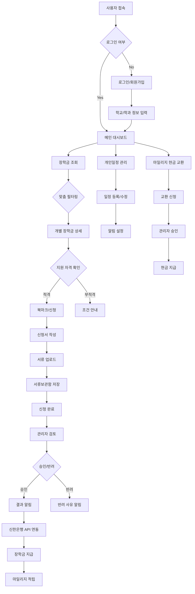
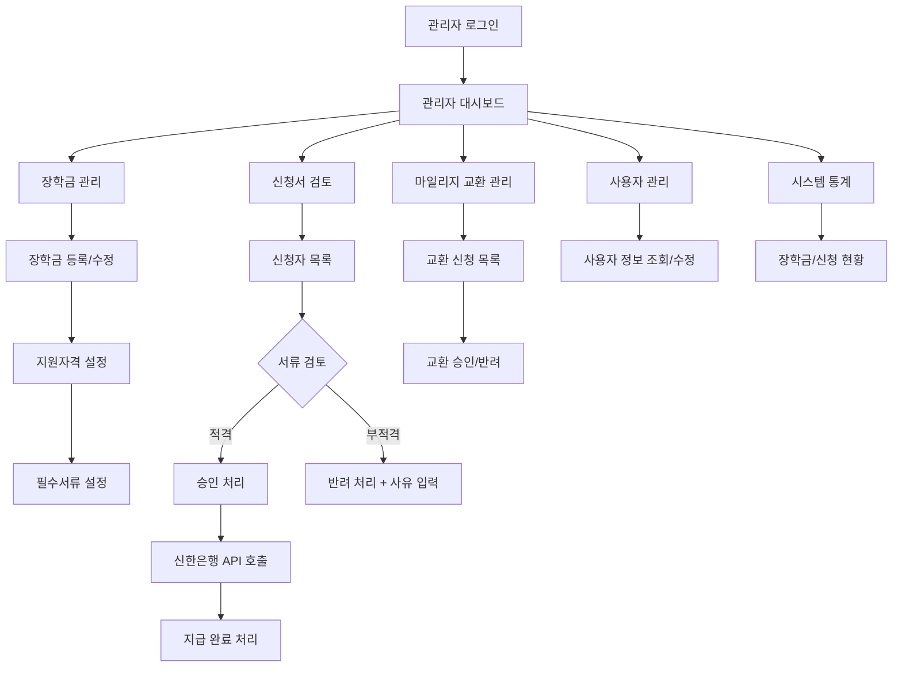
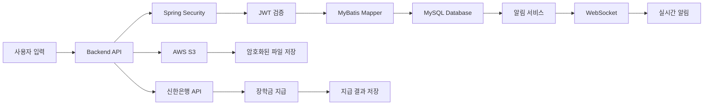
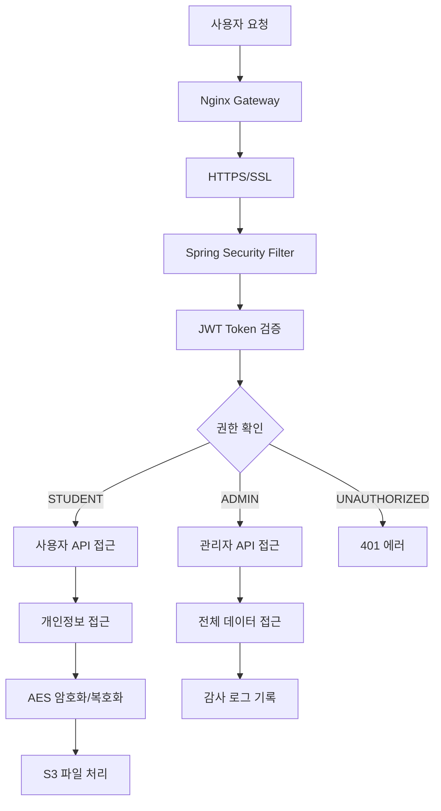

# SOLSOL 시스템 Flow Chart

## 사용자 플로우

```mermaid
graph TD
    A[사용자 접속] --> B{로그인 여부}
    B -->|Yes| C[메인 대시보드]
    B -->|No| D[로그인/회원가입]
    
    D --> E[학교/학과 정보 입력]
    E --> C
    
    C --> F[장학금 조회]
    F --> G{맞춤 필터링}
    G --> H[개별 장학금 상세]
    H --> I{지원 자격 확인}
    I -->|적격| J[북마크/신청]
    I -->|부적격| K[조건 안내]
    
    J --> L[신청서 작성]
    L --> M[서류 업로드]
    M --> N[서류보관함 저장]
    N --> O[신청 완료]
    
    O --> P[관리자 검토]
    P --> Q{승인/반려}
    Q -->|승인| R[결과 알림]
    Q -->|반려| S[반려 사유 알림]
    
    R --> T[신한은행 API 연동]
    T --> U[장학금 지급]
    U --> V[마일리지 적립]
    
    C --> W[개인일정 관리]
    W --> X[일정 등록/수정]
    X --> Y[알림 설정]
    
    C --> Z[마일리지 현금 교환]
    Z --> AA[교환 신청]
    AA --> BB[관리자 승인]
    BB --> CC[현금 지급]
```

## 관리자 플로우

```mermaid
graph TD
    A1[관리자 로그인] --> B1[관리자 대시보드]
    B1 --> C1[장학금 관리]
    C1 --> D1[장학금 등록/수정]
    D1 --> E1[지원자격 설정]
    E1 --> F1[필수서류 설정]
    
    B1 --> G1[신청서 검토]
    G1 --> H1[신청자 목록]
    H1 --> I1{서류 검토}
    I1 -->|적격| J1[승인 처리]
    I1 -->|부적격| K1[반려 처리 + 사유 입력]
    
    J1 --> L1[신한은행 API 호출]
    L1 --> M1[지급 완료 처리]
    
    B1 --> N1[마일리지 교환 관리]
    N1 --> O1[교환 신청 목록]
    O1 --> P1[교환 승인/반려]
    
    B1 --> Q1[사용자 관리]
    Q1 --> R1[사용자 정보 조회/수정]
    
    B1 --> S1[시스템 통계]
    S1 --> T1[장학금/신청 현황]
```

## 데이터 플로우

```mermaid
graph LR
    A[사용자 입력] --> B[Backend API]
    B --> C[Spring Security]
    C --> D[JWT 검증]
    D --> E[MyBatis Mapper]
    E --> F[MySQL Database]
    
    B --> G[AWS S3]
    G --> H[암호화된 파일 저장]
    
    F --> I[알림 서비스]
    I --> J[WebSocket]
    J --> K[실시간 알림]
    
    B --> L[신한은행 API]
    L --> M[장학금 지급]
    M --> N[지급 결과 저장]
```

## 보안 플로우

```mermaid
graph TD
    A[사용자 요청] --> B[Nginx Gateway]
    B --> C[HTTPS/SSL]
    C --> D[Spring Security Filter]
    D --> E[JWT Token 검증]
    E --> F{권한 확인}
    F -->|ADMIN| G[관리자 API 접근]
    F -->|STUDENT| H[사용자 API 접근]
    F -->|UNAUTHORIZED| I[401 에러]
    
    H --> J[개인정보 접근]
    J --> K[AES 암호화/복호화]
    K --> L[S3 파일 처리]
    
    G --> M[전체 데이터 접근]
    M --> N[감사 로그 기록]
```